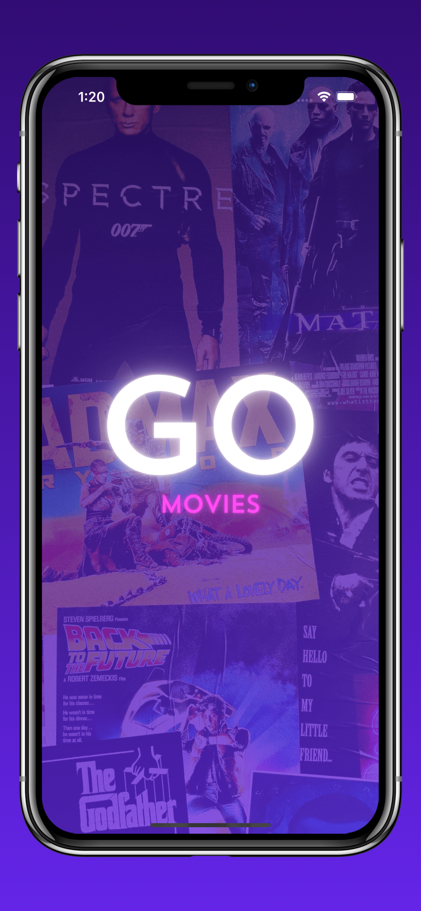
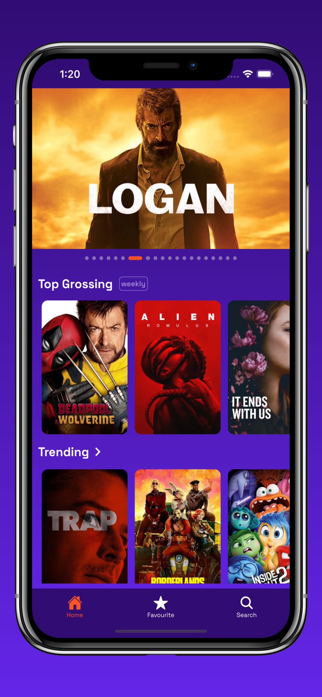
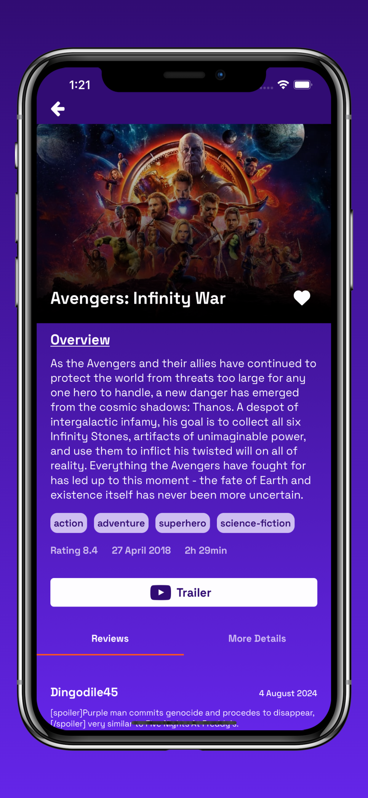
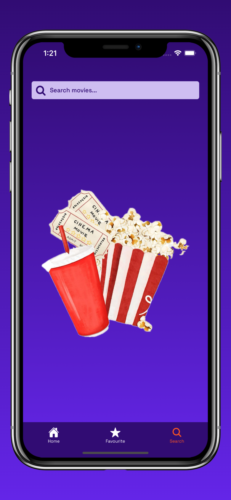
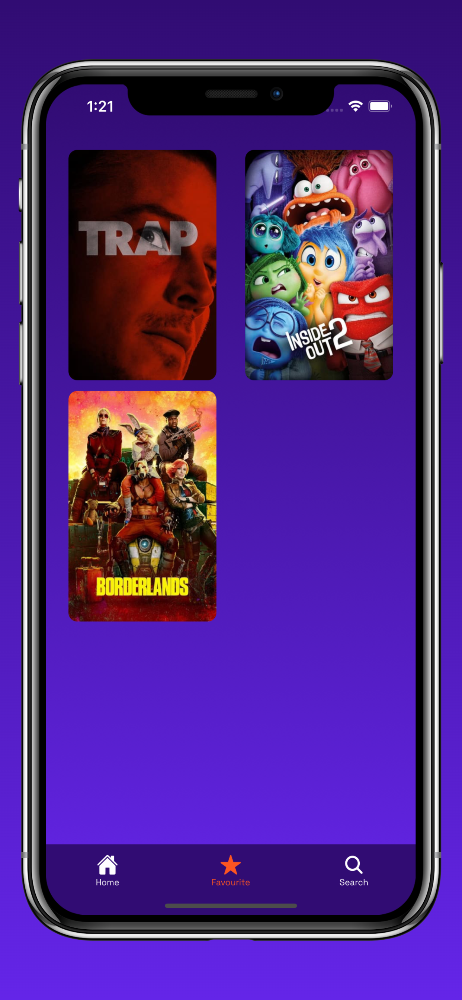

<p align="center">
<kbd>
  </kbd>
</p>

<div align="center">


</div>

<p align="center">
<strong>Go-Movies</strong> is a React Native app that serves as your go-to movie companion. It provides users with comprehensive movie descriptions, detailed cast and crew information, and user ratings.
</p>

## Download Links 📥
- [iOS](https://apps.apple.com/uz/app/go-movies/id6670488630)
- [Android](https://drive.google.com/file/d/18MTZuGpDx1VsvZUwxfqyBt_eArb45Jc4/view?usp=sharing)

## Tech Stack

- **Expo**
- **React Navigation**
- **Redux ToolKit**

## Screenshots

<div>





</div>


## Environment Variables

1. To run this project, you will need to get your own API Keys from the following providers:

    - [Trakt](https://trakt.docs.apiary.io/#)
    - [TMDB](https://developer.themoviedb.org/reference/intro/getting-started)
    - [Fanart.Tv](https://fanart.tv/get-an-api-key/)
    - [OMDB](https://www.omdbapi.com/)
2. Add TMDB, Trakt, Fanart.Tv API Keys in `/src/utils/https.js` and OMDB in `/src/utils/movies.js`

(***TMDB is blocked by some ISPs in India and hence had to rely on other alternatives like Trakt, Fanart, OMDB***)

## Run Locally

Clone the project

Install dependencies

```bash
  npm install
```

Start the server

```bash
  npx expo run
```

